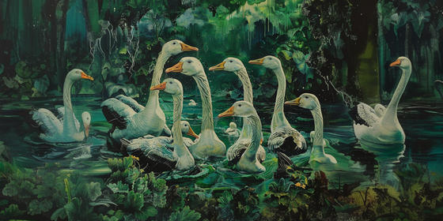

<div align='center'>
    
</div>

# Flood Prediction - Kaggle Playground Series (Season 4, Episode 5) 🐚🔮

## Introduction 🌊

The goal of this competition is to predict the probability of a region flooding. It is particularly well suited for visualizations, clustering, and general EDA, to Show off your skills!

## **Objective** 🎯

Your mission is to develop robust machine learning models capable of accurately predicting the flood prediction based on various attributes.

## **Evaluation** 📊

Your submissions will be evaluated using the **Root Mean Squared Logarithmic Error (RMSLE)** metric. This metric ensures your predictions are as close as possible to the true values while penalizing large errors.


## Dataset 📦
The dataset for this competition includes various physical measurements of abalones, such as length, diameter, height, and weight. These features serve as valuable indicators of abalone age.

## Files 📄

- **train.csv**: The training dataset; FloodProbability is the target
- **test.csv**: The test dataset; your objective is to predict the FloodProbability for each row
- **sample_submission.csv**: A sample submission file in the correct format 

## Installation & Usage 💻

Follow these simple steps to get started:

1. **Clone the Repository**: 
    ```bash
    git clone https://github.com/yashksaini-coder/Regression-with-Flood-Prediction
    ```

2. **Navigate to the Repository Directory**:
    ```bash
    cd Regression-with-Flood-Prediction
    ```

3. **Install Dependencies**:
    ```bash
    pip install -r requirements.txt
    ```

**Explore the dataset, develop your machine learning models, and submit your predictions through the Kaggle competition platform before the deadline.**

## Dependencies 🛠️

- Python 3.9
- Data manipulation libraries (e.g., Pandas, NumPy)
- Machine learning libraries (e.g., Scikit-learn, TensorFlow, PyTorch)

---

### 🐚✨ **Author**:-
### [Linkedin](https://www.linkedin.com/in/yashksaini/)
### [GitHub](https://github.com/yashksaini-coder)

